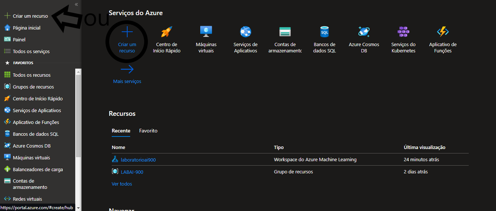

# (dio)Análise de Sentimentos com Language Studio no Azure AI
## PASSO 1 - Acessando
- Acessando o [site](https://speech.microsoft.com/portal)
- Clica em configurações e em criar um novo recurso, se não tiver nenhum 
- Quando tiver o recurso, selecione e clique em usar o recurso
## PASSO 2 - Conversão de fala em texto
- Volta para tela inicial, seleciona conversão de fala em texto em tempo real
- Selecionar o botão abaixo de usar com o seu recurso
- selecionar o idioma do audio que você colocar
- colocar o audio
## PASSO 3 - Análise de sentimentos do texto
- Abrir o [Azure](https://azure.microsoft.com/pt-br/free/)
- Selecionar em criar um recurso
    
- Selecionar IA + Machine Learning 
- Selecione Análise de texto e depois selecione criar
- Vai aparecer a tela com o titulo de Select additional features, aperte no botão para continue to create your resource
- A próxima tela vai ter que configurar e depois apertar para examinar + criar
- revise as informações e aperte para criar 
- espere um pouco pela implantação, assim que finalizar vai aparecer para ir para o grupo de recursos, e quando aparecer você clica
- Abra o [próximo site](https://language.cognitive.azure.com/)
- Configure e aperte em done
-Selecionar em Classify text e depois analyze sentiment and mine opinions
- Acesse a [documentação](https://microsoftlearning.github.io/mslearn-ai-fundamentals/Instructions/Labs/06-text-analysis.html)
- Copie e cole lá esse texto:  
 Tired hotel with poor service
 The Royal Hotel, London, United Kingdom
 5/6/2018
 This is an old hotel (has been around since 1950's) and the room furnishings are average - becoming a bit old now and require changing. The internet didn't work and had to come to one of their office rooms to check in for my flight home. The website says it's close to the British Museum, but it's too far to walk.
 - Clica acima do botão run e clica em run
 