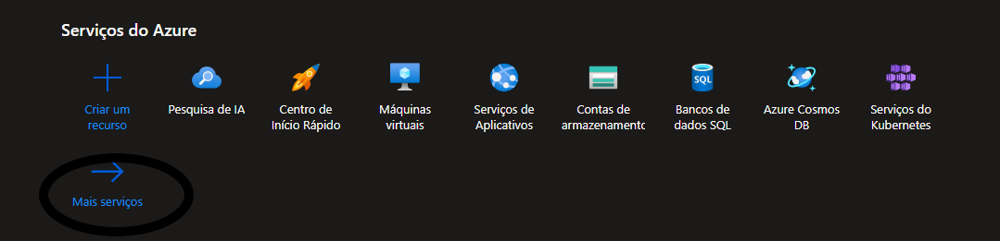
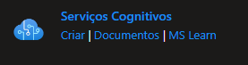
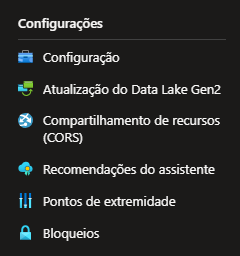
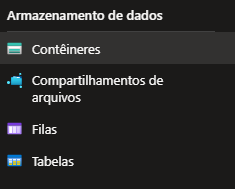

#  (dio) Azure Cognitive Search: Utilizando AI Search para indexação e consulta de Dados

## Passo 1
- Entre em [Azure](https://azure.microsoft.com/pt-br/free/) 
- Faça o login 
- selecione mais serviços
    
- selecione pesquisa de ia 
    
- crie um novo ai search e na parte de camada de preços trocar para o básico 
- aperte em revisar + criar 
- aperte em criar e espere a implementação ser concluida 
## Passo 2
- aperte em criar um recurso
- aperte em ia + machine learning
- clique em criar serviços cognitivos
    
- configure os campos que estão vazios e clique para confirmar que você leu e compreendeu os termos 
- clique em examinar e criar
-aperte em criar e espere a implementação ser concluida 
## Passo 3
- aperte em página inicial
- selecione contas de armazenamento
- clique em criar 
- configure as partes que estão em branco e na parte de redundância mude para LRS
- aperte em examinar e espere até poder clicar em criar e clique em criar e espere a implantação ser concluida
- depois de criar a conta de armazenamento, selecione a conta de armazenamentoque você criou
- procure por configurações na barra lateral que apareceu e selecione configuração
    
- em Permitir acesso anônimo ao Blob você selecione habilitado e aperte em salvar na parte de cima da tela 
## Passo 4
- na barra lateral que apareceu, procure por armazenamento de dados e selecione contêineres
    
- selecione em criar
- de acordo com a [documentação](https://microsoftlearning.github.io/mslearn-ai-fundamentals/Instructions/Labs/11-ai-search.html) você configura, na parte do nome, a configuração recomenda você colocar coffee-reviews mas se você colocar e der erro é só colocar coffeereviews
- em Nível de acesso público selecione Contêiner (acesso de leitura anônimo para contêineres e blobs)
- aperte em criar
- abra o contêiner e depois acesse a documentação e baixe o link de comentários sobre zipped coffee e aperte em carregar os arquivos no contêiner, selecione o arquivo e clique em carregar, se o review estiver em zip extraia
## Passo 5
- Vai em pesquisa de ia e clique em importar dados
- configure com base nesse valores: 
    - Fonte de Dados: Armazenamento de Blobs do Azure
    - Nome da fonte de dados: coffee-customer-data
    - Dados para extrair: Conteúdo e metadados
    - Modo de análise: Padrão
    - Cadeia de conexão: *Selecionar Escolha uma conexão existente. Selecione sua conta de armazenamento, selecione o coffee-reviews  e clique em Selecionar.
    - Autenticação de identidade gerenciada: Nenhum
    - Nome do recipiente: essa configuração é preenchida automaticamente depois de escolher uma conexão existente.
    - Pasta blob: Deixe isso em branco.
    - Descrição: Reviews for Fourth Coffee shops.
- selecionar próximo: adicionar habilidades cognitivas (opcional) 
- em nome do conjunto de habilidade mude para coffee-skillset
- clique em habilitar OCR e mesclar todo o texto no campo merged_content
- em nível de granularidade do enriquecimento mude para páginas (partes de caracteres de 5000), não selecione para habilitar o enriquecimento incremental 
- das habilidades cognitivas de texto selecione extrair nomes de localização, extrair frases-chave e detectar sentimento e das hablidades cognitivas de imagem selecione todos
- em salvar os enriquecimentos em um repositório de conhecimento clique em projeções de imagem e em Projeções de tabela do Azure selecione documentos, se aparecer um aviso, você seleciona uma conexão existente e seleciona a conta de armazenamento que você criou mais cedo, crie um novo contêiner e nomeie como knowledge-store e deixe privado e crie, selecione esse contêiner, e em projeções de blob do Azure selecione documento.
- selecione Próximo: Personalizar índice de destino
- mude o Nome do índice para coffe-index e selecione filtrável em content e clique em próximo: criar um indexador
- no nome do indexador mude para coffee-indexer
- clique em opções avançadas, veja se a opção Chaves de Codificação de Base 64 está marcada e clique em enviar 
- selecione indexadores em gerenciamento de pesquisa, selecione o coffee-indexer, espere um minuto e selecione ↻ Atualizar até o Status indicar sucesso.
## Passo 6
- Vá para o seu serviço Pesquisa e selecione gerenciador de pesquisa, clique em exibir e depoisem exibição JSON e cole isso e clique em pesquisar, a consulta de pesquisa retorna todos os documentos no índice de pesquisa, incluindo uma contagem de todos os documentos no @odata.count campo. O índice de pesquisa deve retornar um documento JSON contendo os resultados da pesquisa. :
```
{
    "search": "*",
    "count": true
}
```
- Agora copie e cole isso e clique em pesquisar, a consulta pesquisa todos os documentos no índice e filtra as avaliações com um local em Chicago. Você deveria ver 3 no @odata.count campo.:
```
{
 "search": "locations:'Chicago'",
 "count": true
}
```
- Agora copie e cole isso e clique em pesquisar, a consulta pesquisa todos os documentos no índice e filtra as revisões com um sentimento negativo. Você deveria ver 1 no @odata.count campo.:
```
{
 "search": "sentiment:'negative'",
 "count": true
}
```
## Passo 7 
- No Search Explorer em visualização de consulta, coloque search=*&$count=true, e clique em "search" deve aparecer algo semelhante a isso:
```
{
  "@odata.context": "https://aisearchteste1.search.windows.net/indexes('coffee-index')/$metadata#docs(*)",
  "@odata.count": 0,
  "value": []
}
```
- coloque search=locations:'Chicago' para trazer os reviews dos sentimentos de cada 
- coloque search=sentiment:'negative' para filtrar os sentimentos negativos

## Observação:
Esse serviço é bom para aplicativos tipo IFood para filtrar as avaliações negativas dos usuarios e sua causa, em busca de melhorar a experiencia do cliente 