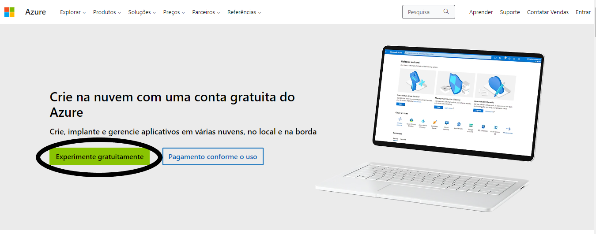
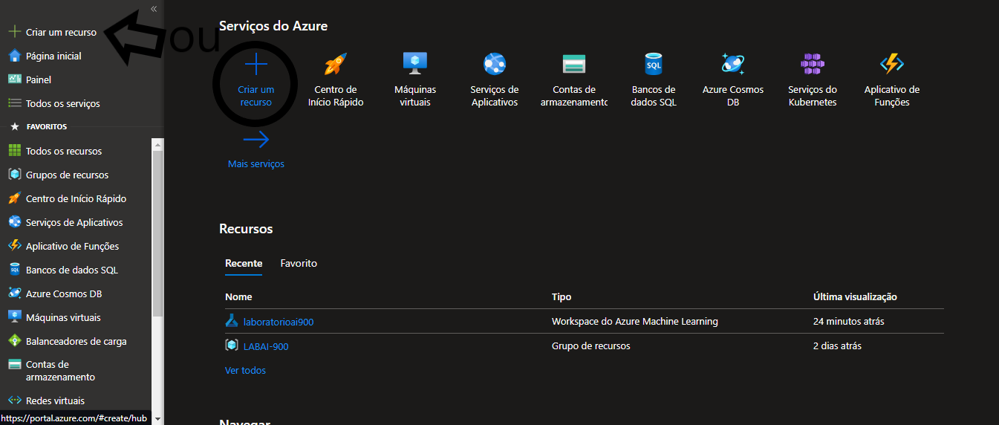
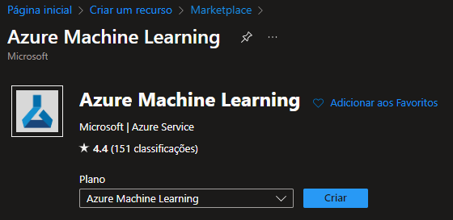

# (dio)Trabalhando com machine learning na pratica no Azure ML
## PASSO 1 - Criando conta
- Entrar no site da [Azure](https://azure.microsoft.com/pt-br/free/) 
- Criar sua conta, mesmo criando a conta gratuita, vai pedir um cartão de crédito, vai creditar um valor simbolico para testar o cartão
  
## PASSO 2 - Selecionando a ferramenta
- Selecionar "Criar um recurso"
   
- Pesquisar Machine Learning
- Selecionar Azure Machine Learning
  
    
## PASSO 3 - Configurando o Azure Machine Learning
- Com o Azure Machine Learning selecionado, vai ter que criar um novo workspace e criar um novo resource group, criar um nome, a região, e clicar em Examinar e criar
- Esperar que a validação seja aprovada, para clicar em criar.
- A implantação fica em andamento e pode ser acompanhada em uma tela que vai ser aberta automaticamente.
- Quando for concluída vai mostrar na tela.
- Vá para tela de recurso e clique em Iniciar estúdio
- O diretório do workspace é aberto, podendo ver os workspaces existentes em All workspaces
- O workspace criado é aberto. Precisa agora entrar no ambiente Automated ML e clicar em criar um new ML automated job
## PASSO 4 - Aprendendo a usar o Azure Machine Learning,Configuração
- De acordo com a [documentação](https://microsoftlearning.github.io/mslearn-ai-fundamentals/Instructions/Labs/01-machine-learning.html) vamos configurar para testar.
- Usando essas informações(Basic Settings):
  - Job name: mslearn-bike-automl
  - New experiment name: mslearn-bike-rental
  - Description: Automated machine learning for bike   
  - rental prediction
  - Tags: none
- Usando essas informações(Task type & data):
    - Selecionar o tipo de tarefa: Regressão
    - Criar o dataset(Data type):
        - Name: bike-rentals
        - Description: Historic bike rental data
        -  Type: Tabular
    - Criar o dataset(Data source):
        - Selecionar De arquivos web
        - (URL da Web):
           - URL da Web: https://aka.ms/bike-rentals
            - Ignorar a validação de dados: não selecione
        - (Configurações):
            - Formato de arquivo: Delimitado
            - Delimitador: Vírgula
            - Codificação: UTF-8
            - Cabeçalhos de coluna: Apenas o primeiro arquivo tem cabeçalhos
            - Pular linhas: Nenhum
            - O conjunto de dados contém dados de várias linhas: não selecione
        - (Esquema):
            - Inclua todas as colunas, exceto Caminho
            - Revise os tipos detectados automaticamente
    - Selecionar Criar. Depois que o conjunto de dados for criado, selecione o aluguel de bicicletas conjunto de dados para continuar a enviar o trabalho de ML automatizado.
    - Selecionar o dataset, e clicar em next
- Usando essas informações(Task Settings):
    - Tipo de tarefa: Regressão
    - Conjunto de dados: aluguel de bicicletas
    - Coluna de destino: Aluguel (inteiro)
    - Configurações adicionais:
    - Métrica primária: Erro quadrático médio da raiz normalizada
    - Explique o melhor modelo: Não selecionado
    - Use todos os modelos suportados: Unselecionado. Você restrinja o trabalho para tentar apenas alguns algoritmos específicos.
    - Modelos permitidos: Selecionar apenas RandomForest e LightGBM — normalmente você quer tentar o maior número possível, mas cada modelo adicionado aumenta o tempo que leva para executar o trabalho.
    - Limites: Expanda esta seção
    - Testes máximos: 3
    - Testes simultâneos máximos: 3
    - Nós máximos: 3
    - Limiar de pontuação métrica: 0,085 (de modo que, se um modelo atingir uma pontuação média quadrática de erro métrico de raiz normalizada de 0,085 ou menos, o trabalho terminará.)
    - Tempo limite: 15
    - Tempo limite de iteração: 15
    - Ativar a rescisão antecipada: Selecionado
    - Validação e teste:
    - Tipo de validação: Divisão de validação de trem
    - Percentagem de dados de validação: 10
    - Conjunto de dados de teste: Nenhum
- Usando essas informações(Computação):
    - Selecione o tipo de computação: Sem servidor
    - Tipo de máquina virtual: CPU
    - Nível de máquina virtual: Dedicado
    - Tamanho da máquina virtual: Standard_DS3_V2*
    - Número de instâncias: 1
- Pronto, envie o trabalho de treinamento
- Esperar até aparecer que foi concluíd0
## PASSO 5 - Aprendendo a usar o Azure Machine Learning, Implantação
- No Visão geral guia do trabalho de aprendizado de máquina automatizado, observar o melhor resumo do modelo, selecionar o testo abaixo de nome de algoritmo para ver os detalhes, selecionar métricas e e selecionar o resíduos e predicted_true gráficos se eles ainda não estiverem selecionados.
- No Modelo guia para o melhor modelo treinado pelo seu trabalho automatizado de aprendizado de máquina, selecionar Implantar e usar o Serviço web opção para implantar o modelo com as seguintes configurações:
   - Nome: predict-rentals
   - Descrição: Previsão de aluguel de ciclo
    - Tipo de computação: Instância do Container do Azure
    - Ativar autenticação: Selecionado
- Aguardar  o início da implantação (O Deploy status para o predict-rentals o endpoint será indicado na parte principal da página como Running).
- Esperar pelo Deploy status mudar para Succeeded. Isso pode levar 5-10 minutos.
## PASSO 6 - Aprendendo a usar o Azure Machine Learning, Testando
- Selecionar endpoints e abrir predict-rentals, e clica em test, apaga o json existente e coloca esse:
``` {
   "Inputs": { 
     "data": [
       {
         "day": 1,
         "mnth": 1,   
         "year": 2022,
         "season": 2,
         "holiday": 0,
         "weekday": 1,
         "workingday": 1,
         "weathersit": 2, 
         "temp": 0.3, 
         "atemp": 0.3,
         "hum": 0.3,
         "windspeed": 0.3 
       }
     ]    
   },   
   "GlobalParameters": 1.0
 }
 ```
 - Clicar no botão de Teste
 - Deve aparecer um resultado tipo esse:
 ``` 
 {
  "Results": [
    346.1077623504539
  ]
} 
```
- (O painel de teste pegou os dados de entrada e usou o modelo que você treinou para retornar o número previsto de aluguéis.)
