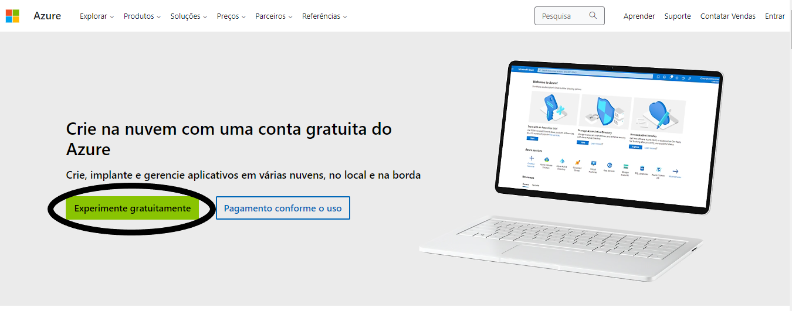
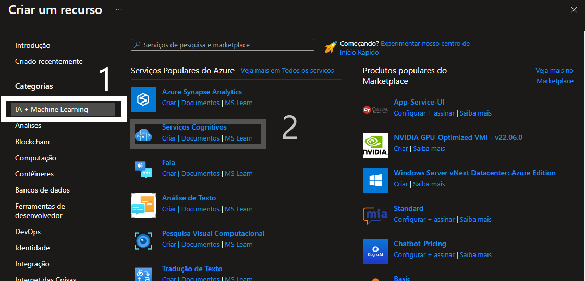

# (dio)Reconhecimento Facial e transformação de imagens em Dados no Azure ML
## Passo 1 - Configurando
- Clicar em criar um novo recurso
    
- Clicar em IA + Machine Learning
- Escolher Serviços Cognitivos e clicar em criar
    
- Preencher as informações e depois apertar em review + create e depois em create, esperar a conclusão do deploy
## Passo 2 - Testando (detecção de rostos em uma imagem)
- Acesse o [portal](https://portal.vision.cognitive.azure.com/gallery/featured/)
- Clicar em ver todos os recursos
- Selecionar o mais recente que você criou
- Selecionar em default, não deve acontecer nada
- Volta para tela anterior e seleciona face e depois detect faces in an image
- selecionar o botão abaixo de try in out e vai aparecer algumas imagens para testar, você pode testar com aquelas imagens ou colocar outra,para testar
## Passo 3 - Testando (extração de textos de uma imagem)
- Volte para o [portal](https://portal.vision.cognitive.azure.com/gallery/featured)
- Selecione o Optical character reconition e depois Extract text from images
- selecionar o botão abaixo de try in out e vai aparecer algumas imagens para testar, você pode testar com aquelas imagens ou colocar outra,para testar
## Passo 4 - Testando (adicionar legendas para imagens)
- Volte para o [portal](https://portal.vision.cognitive.azure.com/gallery/featured)
- Selecione o Image analysis e depois Add captions to images
- selecionar o botão abaixo de try in out e vai aparecer algumas imagens para testar, você pode testar com aquelas imagens ou colocar outra,para testar
